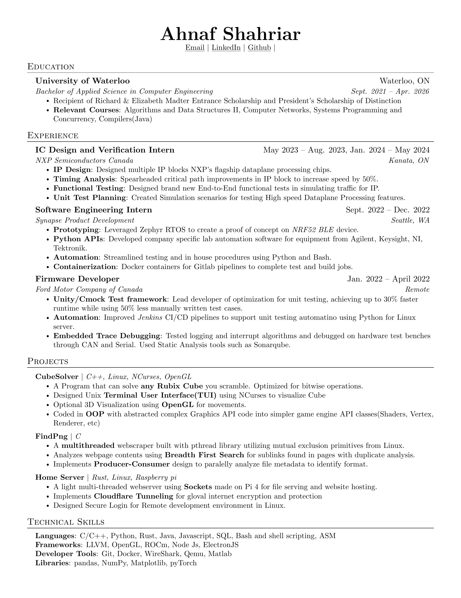

# resume
Made to keep track of the version history of the latest resume

## How to update
```
    latex/pdflatex <filename>.tex     
```
OR simply have the Latex Extension in VScode compile on every save

Template Based off of [sb2nov/resume](https://github.com/sb2nov/resume/)


